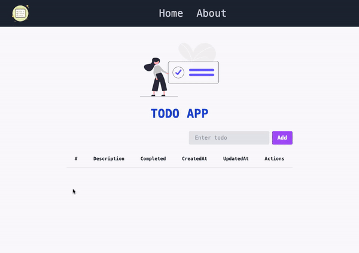

# TODO APP

Simple todo project base-on DDD(domain driven design) with Golang + Tailwindcss + HTMX

<p align="center">
  
</p></p>

<!--toc:start-->

- [TODO APP](#todo-app)
  - [Techs & Tools](#techs-tools)
  - [Dev](#dev)
    - [watch tailwind](#watch-tailwind)
    - [watch templ file](#watch-templ-file)
    - [air hot reload](#air-hot-reload)
  - [Run](#run)
  <!--toc:end-->

## Techs & Tools

- Tailwindcss
- Commitlint
- Golangci
- Air(Hot-reload)
- HTMX
- Templ
- Database
  - SQLite
  - GORM
- Go-fiber
- Validation

## Dev

### watch tailwind

```bash
make dev-tailwind
```

### watch templ file

```bash
make dev-templ
```

### air hot reload

```bash
air
```

## Run

```bash
task run
```
